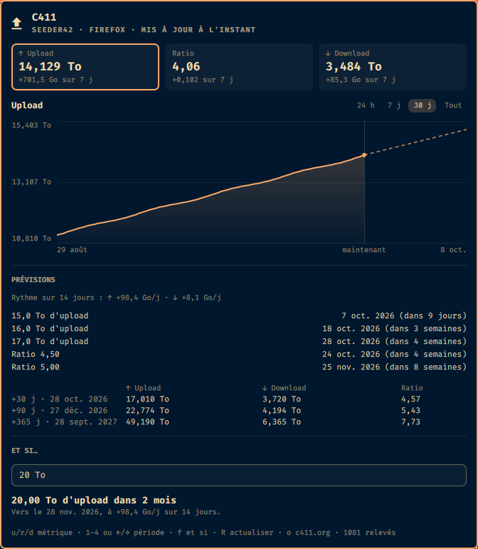
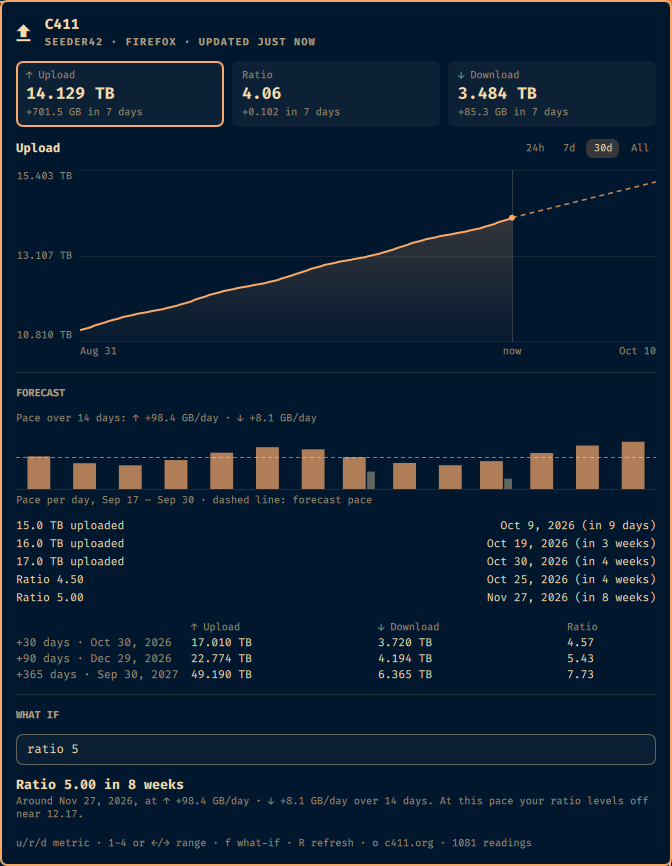
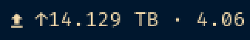

# C411 Trend

*English version: [README.md](README.md).*

Un widget pour la barre d'Omarchy, dédié au tracker privé
[C411](https://c411.org). Il relève ton upload, ton download et ton ratio, en
trace les courbes et prévoit où ils vont : *« à ce rythme, 15 To d'upload le
12 nov. 2026 »*. Tu peux aussi l'interroger sur tes propres objectifs :
*« 20 To d'upload dans 2 mois »*, *« ratio 5,00 dans 8 semaines »*.



## Installation

```bash
omarchy plugin add https://github.com/XNinety9/c411trend.git --enable
```

Il suffit d'être connecté à c411.org dans ton navigateur : le widget trouve la
session tout seul (voir [Navigateurs](#navigateurs)).

## Désinstallation

```bash
omarchy plugin remove x99.c411trend
```

Cela supprime `~/.config/omarchy/plugins/x99.c411trend/` et retire le widget de
la barre. Ton historique reste dans `~/.local/state/c411trend/` (ainsi que ton
cookie collé dans `~/.config/c411trend/`, si tu utilises le réglage `File`) :
une réinstallation reprend là où tu en étais. Supprime ces deux dossiers pour
tout effacer. Le plugin ne touche jamais aux données de ton navigateur.

## Ce que tu obtiens

- **Une pastille dans la barre** avec ton ratio, ou la composition de valeurs
  de ton choix (voir [Texte de la barre](#texte-de-la-barre)).
- **Un panneau** avec trois cases (upload, ratio, download, chacune avec son
  évolution sur 7 jours) et une courbe sur 24 h, 7 j, 30 j ou tout
  l'historique. Survole la courbe pour lire les valeurs exactes.
- **Des prévisions** :
  - les prochains paliers ronds d'upload et de ratio, avec la date estimée ;
  - tes objectifs personnels (`uploadTargetTo`, `ratioTarget`), marqués ◆ ;
  - l'upload, le download et le ratio prévus à 30, 90 et 365 jours ;
  - le rythme jour par jour en petit histogramme, upload et download, avec le
    rythme des prévisions en pointillés (survole un jour pour ses chiffres) ;
  - la tendance prolongée en pointillés après « maintenant » sur la courbe.
- **Et si…** : tape une cible et lis quand tu l'atteindras à ton rythme actuel.
  - `10 To`, `850 Go`, `1,5 TB` : un volume d'upload ;
  - `ratio 3,5`, `r 5`, `5x` : un ratio ;
  - `5` : un nombre seul peut vouloir dire les deux, tu as donc les deux
    réponses, pour 5 To et pour un ratio de 5 ;
  - la réponse dit *quand* (« dans 2 mois, vers le 28 nov. 2026 »), *à quel
    rythme*, ou *pourquoi pas* : déjà atteint (avec le jour du franchissement),
    pas d'upload récent, ou un ratio qui plafonne avant la cible ;
  - la dernière question est gardée d'une session à l'autre.

### Comment marchent les prévisions

Le rythme est la pente, calculée par moindres carrés, de l'upload et du
download sur les *N* derniers jours (14 par défaut, `forecastWindowDays`). Le
ratio prévu se déduit des deux, `(U + a·t) / (D + b·t)`, au lieu d'être
prolongé tout seul. C'est pour ça qu'une cible au-dessus de `a/b` apparaît hors
d'atteinte à ce rythme, et qu'un ratio en baisse peut aussi être prévu
(« ratio à 1,00 dans 3 semaines »). Les prévisions apparaissent après une heure
d'historique et se stabilisent à mesure que la fenêtre se remplit.

Si C411 perd des données et que tes compteurs reculent (plantage, restauration
d'une sauvegarde), le rythme ne compte que les hausses entre deux relevés : la
chute n'est pas de l'activité négative. Les prévisions repartent du compteur
réel, et le panneau indique quand et de combien les compteurs ont reculé.

## Navigateurs

Avec **Browser** sur `Auto` (par défaut), le widget essaie dans l'ordre : le
magasin de cookies qui a marché la dernière fois, ton navigateur par défaut,
puis tous les autres navigateurs ci-dessous jusqu'à trouver une session
c411.org valide.

| Famille | Navigateurs | Où |
| --- | --- | --- |
| Chromium | Brave, Chrome, Chromium, Edge, Vivaldi, Opera, Thorium | natif, Flatpak, Snap (Chromium) |
| Firefox | Firefox, Zen, LibreWolf, Floorp, Waterfox | natif, Flatpak, Snap (Firefox), y compris `~/.config/mozilla` |
| Manuel | tous | `File` : colle l'en-tête `Cookie` dans `~/.config/c411trend/cookie` |

Les cookies Chromium sont déchiffrés avec la clé « Safe Storage » du
navigateur, lue dans le Secret Service (`secret-tool`) : GNOME Keyring, ou
KWallet avec le Secret Service activé, doit être déverrouillé. Les cookies
Firefox ne sont pas chiffrés.

`bin/c411trend-fetch --list` montre les magasins qui seraient essayés, sans les
ouvrir.

## Vie privée et sécurité

Le cookie n'est envoyé qu'à `https://c411.org/api/auth/me`. Il n'est jamais
écrit, journalisé ni passé en ligne de commande. L'historique ne contient que
des nombres. Tous les détails, frontières de confiance et limites comprises,
sont dans [SECURITY.md](SECURITY.md) (en anglais).

Nécessite `python3` et `curl`. Les navigateurs Chromium demandent en plus
`secret-tool` (libsecret, inclus dans la base d'Omarchy) et le module Python
`cryptography`, qui n'est pas toujours installé : ajoute le paquet
`python-cryptography` si le panneau signale qu'il manque. Les navigateurs de la
famille Firefox et le mode `File` n'ont besoin ni de l'un ni de l'autre.

## Utilisation

| Action | Effet |
| --- | --- |
| clic | ouvre le panneau |
| clic milieu | relève maintenant |
| clic droit | ouvre c411.org |
| `u` / `r` / `d`, `j` / `k` | métrique de la courbe |
| `1`–`4`, `h` / `l` | période : 24 h, 7 j, 30 j, tout |
| `R` | relève maintenant |
| `o` | ouvre c411.org |
| `f` ou `/` | tape une cible « et si » (`Entrée` la garde, `Échap` revient) |

IPC : `omarchy-shell x99.c411trend refresh | status | forecast | samples | version`,
et `omarchy-shell x99.c411trend when "10 To"` (ou `"ratio 5"`) pour un « et
si » en ligne de commande.

## Langue

Le panneau, le texte de la barre et les messages d'erreur existent en anglais
(US) et en français. **Language** (`language`) vaut `Auto` par défaut et suit
la langue de ta session : français si `LANG` commence par `fr`, anglais sinon.
Choisis `English` ou `Français` pour forcer. Le changement est immédiat, sans
redémarrage.

En français, les unités et les usages sont ceux du tracker : `14,129 To`,
`+98,4 Go/j`, `12 nov. 2026`, `dans 3 semaines`. Dans les deux langues, les
tailles sont des multiples binaires, comme sur le tracker : 1 To (1 TB) vaut
1024⁴ octets.



## Texte de la barre

`barFormat` est un modèle, comme dans Dockarchy : chaque `{clé}` est remplacée
par sa valeur et tout le reste est conservé. Tu peux donc composer plusieurs
valeurs avec tes propres séparateurs.



| Clé | Valeur |
| --- | --- |
| `{up}` `{down}` `{ratio}` | totaux, comme sur le site |
| `{credit}` | crédit d'upload (bonus) |
| `{buffer}` | upload moins download |
| `{rate}` `{downrate}` | rythme quotidien d'upload / de download |
| `{up24h}` `{up7d}` `{up30d}` | upload gagné sur les dernières 24 h, 7 ou 30 jours |
| `{down24h}` `{down7d}` `{down30d}` | pareil pour le download |
| `{ratio24h}` `{ratio7d}` `{ratio30d}` | évolution du ratio sur les mêmes périodes |
| `{next}` `{nexteta}` | prochain palier rond d'upload et le temps pour l'atteindre |
| `{goal}` `{ratiogoal}` | temps jusqu'à ton objectif d'upload / de ratio (`uploadTargetTo`, `ratioTarget`) : une durée, `✓` une fois atteint, `∞` si hors d'atteinte |
| `{user}` | ton pseudo C411 |

Alias : `{upload}` `{ul}` = `{up}`, `{download}` `{dl}` = `{down}`,
`{bonus}` = `{credit}`, `{uprate}` = `{rate}`. Les clés ignorent la casse et
acceptent des espaces (`{ up }`) ; `{{` et `}}` affichent des accolades ; une
clé inconnue reste telle quelle, pour qu'une faute de frappe se voie. Un
modèle vide n'affiche que l'icône.

```bash
omarchy bar set x99.c411trend barFormat '{ratio}'                     # 4,06
omarchy bar set x99.c411trend barFormat '↑{up} · {ratio}'              # ↑14,129 To · 4,06
omarchy bar set x99.c411trend barFormat '{ratio} ({ratio7d})'          # 4,06 (+0,102)
omarchy bar set x99.c411trend barFormat "{up24h} aujourd'hui · {rate}" # +131,6 Go aujourd'hui · +98,4 Go/j
omarchy bar set x99.c411trend barFormat '{next} dans {nexteta}'       # 15,0 To dans 9 jours
omarchy bar set x99.c411trend barFormat '20 To dans {goal}'           # 20 To dans 2 mois (uploadTargetTo = 20)
omarchy bar set x99.c411trend barFormat ''                             # icône seule
```

## Réglages

Depuis les réglages du shell, ou `omarchy bar set x99.c411trend <clé> <valeur>` :

| Clé | Défaut | |
| --- | --- | --- |
| `language` | `Auto` | `Auto`, `English` ou `Français` |
| `browser` | `Auto` | ou un nom de navigateur, ou `File` |
| `browserProfile` | *(tous)* | dossier du profil : `Default`, `Profile 1`, `default-release`… |
| `refreshIntervalMin` | `30` | minutes entre deux relevés |
| `forecastWindowDays` | `14` | jours sur lesquels le rythme est mesuré |
| `uploadTargetTo` | `0` | objectif d'upload toujours listé dans les prévisions, en To |
| `ratioTarget` | `0` | objectif de ratio toujours listé dans les prévisions |
| `defaultRange` | `30d` | `24h`, `7d`, `30d`, `all` |
| `barFormat` | `{ratio}` | voir [Texte de la barre](#texte-de-la-barre) |
| `panelWidth` | `672` | pixels |

Les libellés des réglages dans le panneau de réglages du shell restent en
anglais : le manifeste d'un plugin Omarchy n'a qu'une langue.

## Données

L'historique est dans `~/.local/state/c411trend/history.jsonl`, un objet JSON
par ligne (`t`, `up`, `down`, `ratio`, `credit`, et `"manual": true` en
option). Tu peux y ajouter d'anciens relevés à la main. Les relevés n'ont lieu
que pendant ta session de bureau : la courbe relie les points par-dessus les
trous. Le fichier est compacté au-delà de 2 Mio et garde le détail complet sur
90 jours.

## Développement

Depuis une copie de ce dépôt dans `~/Projects/C411Trend` :

```bash
ln -s ~/Projects/C411Trend ~/.config/omarchy/plugins/x99.c411trend
omarchy bar put x99.c411trend

npm test                                       # tests node du modèle + tests Python du script
MARKETPLACE_DIR=../omarchy-plugin-marketplace npm run baseline
omarchy plugin validate .
```

Le shell ne recharge pas à chaud les fichiers derrière un dossier de plugin en
lien symbolique : lance `omarchy restart shell` après une modification du QML,
puis vérifie `omarchy-shell x99.c411trend version`.

Les captures n'utilisent que des données fictives. `docs/demo/photo-session.sh
<dossier>` installe un historique inventé (`docs/demo/fake-history.py`) et un
faux script de récupération, prend les captures anglaise, française et de la
barre, puis restaure ton vrai historique, le script et tes réglages à
l'identique, même en cas d'échec en cours de route.

## Licence

[WTFPL](LICENSE).
